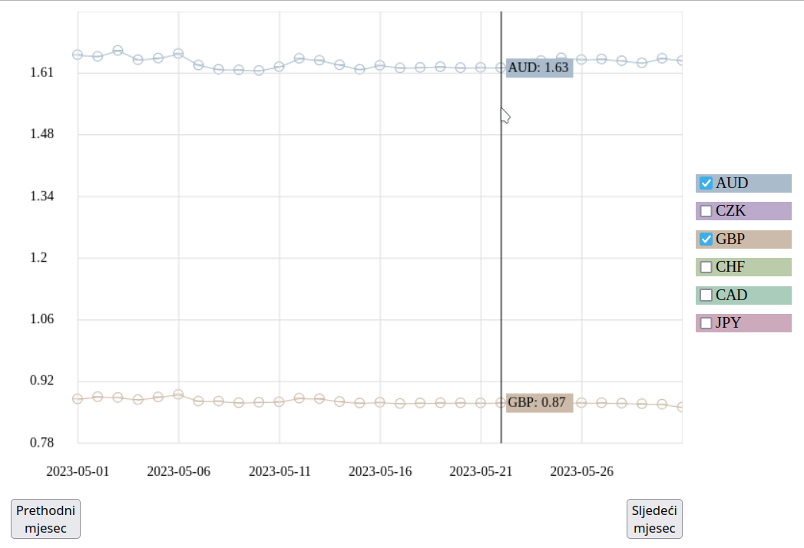

# Currency Exchange Rate Trend Visualizer

This project is a currency exchange rate trend visualizer that allows for interactive exploration of historical exchange rate data using a designated API. Built with JavaScript, jQuery, AJAX, and Canvas, it features dynamic data retrieval, interactive graphs, and responsive controls.

## Screenshot

## API Usage

To retrieve historical exchange rate data, this project utilized the ExchangeRate API, accessible at [exchangerate.host](https://api.exchangerate.host/). **However, please note that since the project was created in July 2023, the API is no longer free, and its documentation has changed significantly.**

- The application would make AJAX requests to the API, specifically to endpoints formatted as `https://api.exchangerate.host/date`, where `date` would be in the format `YYYY-MM-DD` (e.g., `2023-05-30`).
- For each request, the parameters would include:
  - **base**: the base currency, which is set to 'EUR' for this project.
  - **symbols**: a string containing the currency codes (comma-separated, without spaces) for the currencies we would want to retrieve exchange rates for (e.g., 'USD,CZK').

The API would return a JSON response containing the exchange rates for the specified currencies relative to the base currency. This data would then be processed and displayed graphically on the canvas, allowing users to visualize the trends over a selected historical period.

- **Updated API Access**: The API now requires a subscription for access, which may affect the ability to fetch data.
- **Request Structure Changes**: The way requests are formatted and the parameters required have changed. **As a result, the project code needs to be updated to align with the new API specifications to ensure that the visualizer works properly and can fetch the required data successfully.**

## Usage
To start using the visualizer, clone or download the repository and open the `exchange-rates.html` file in your browser.

1. **Select Currencies**: Check the boxes next to the currencies you wish to track.
2. **Navigate Months**: Use the **Previous** and **Next** buttons to explore different months. Data will load automatically for the selected date range.
3. **Hover Over the Graph**: When hovering the mouse over the graph, a "tooltip" will display the value of all included currencies for the date directly under the cursor.

## Project Structure

- `exchange-rates.html`: Main HTML file containing the layout.
- `exchange-rates.css`: Stylesheet for formatting and layout.
- `exchange-rates.js`: JavaScript logic for data retrieval, graph drawing, and user interactions.

## Technologies Used
- HTML
- CSS
- JavaScript
- jQuery
- AJAX
- Canvas

## Contribution
If you would like to contribute to this project, feel free to open an issue or submit a pull request.
